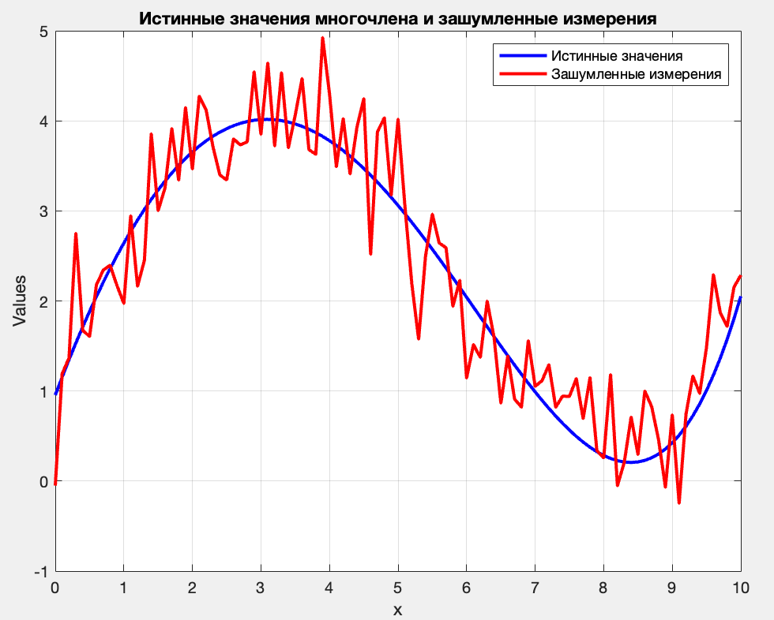
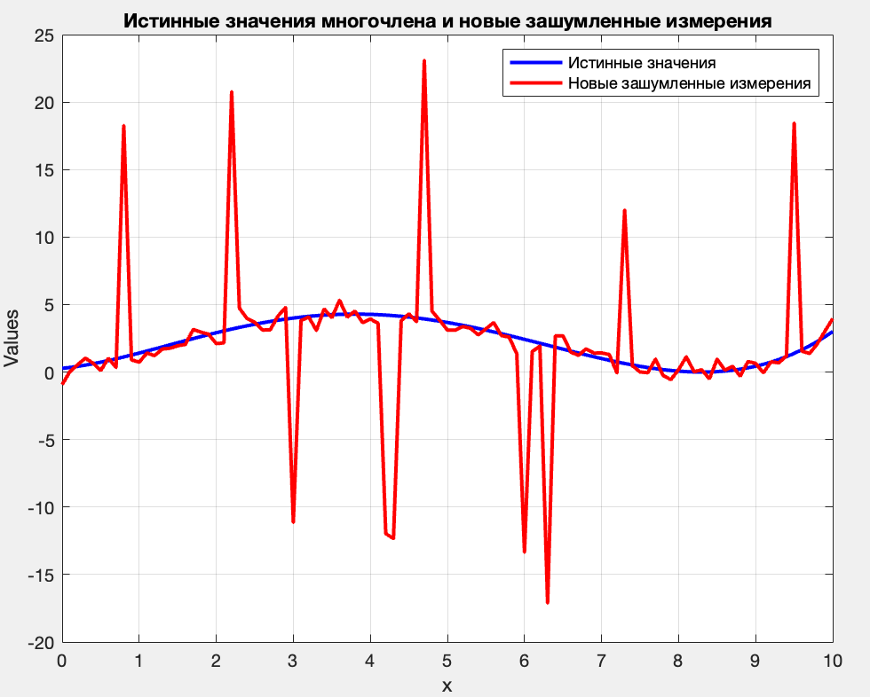
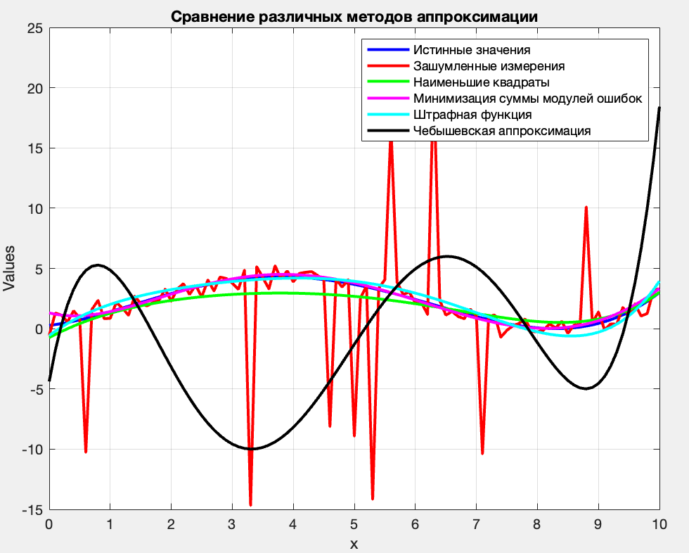

# Отчет о Работе №1. Аппроксимация.

## Введение

В данной работе была поставлена задача построения многочлена пятой степени, удовлетворяющего определенным ограничениям, а также аппроксимации этого многочлена с использованием различных методов на фоне внесения белого гауссовского шума и дополнительной случайной помехи.

## Описание Работы

### Задача 1: Построение Многочлена

Многочлен пятой степени $`p(x)`$ был построен с учетом следующих ограничений:
- $`0 \leq p(x[i]) \leq 5 `$  для $`x[i] = 0.1i `$, где $` i = 0, ..., 100 `$.
- Специфические ограничения в определенных точках, такие как $` p(0) \leq 1 `$, $` p(3) \geq 4 `$, и т.д.

Был использован метод оптимизации с помощью инструментов YALMIP и SDPT3 в MATLAB для нахождения коэффициентов многочлена.

#### График 1

На первом графике представлен построенный многочлен на интервале от 0 до 10.

### Задача 2: Зашумленные Измерения

К истинным значениям многочлена был добавлен белый гауссовский шум с дисперсией 0.3 для создания зашумленных измерений.

#### График 2

На втором графике изображены истинные значения многочлена и зашумленные измерения.

### Задача 3: Аппроксимация

Использовались четыре метода аппроксимации для оценки коэффициентов многочлена по зашумленным измерениям:
1. Метод наименьших квадратов.
2. Минимизация суммы модулей ошибок.
3. Минимизация суммы значений штрафной функции $` \sqrt{|t|} `$.
4. Чебышевская аппроксимация.

#### График 3

На третьем графике представлены истинные значения многочлена и результаты всех четырех методов аппроксимации.

Вывод: Для функции, искаженной белым гауссовским шумом, наиболее подходит метож наименьших квадратов, наименее - Чебышеская аппроксимация.
Минимизация суммы модулей ошибок и минимизация суммы значений штрафной функции также показывают достаточно хорошие результаты, как и метод наименьших квадратов.

### Задача 4: Дополнительное Зашумление

Была добавлена дополнительная помеха к зашумленным измерениям. Помеха принимает значение 0 с вероятностью 0.9 и случайное значение от -20 до 20 (по модулю не менее 10) с вероятностью 0.1.

#### График 4

На четвертом графике представлена визуализация дополнительно зашумленных данных.

### Задача 5: Аппроксимация по дополнительному зашумлению

Также как и в задаче 3 использовались четыре метода аппроксимации для оценки коэффициентов многочлена по дполнительно зашумленным измерениям:
1. Метод наименьших квадратов.
2. Минимизация суммы модулей ошибок.
3. Минимизация суммы значений штрафной функции $` \sqrt{|t|} `$.
4. Чебышевская аппроксимация.

#### График 5

На четвертом графике представлены истинные значения многочлена и зашумленные измерения с дополнительной помехой.    
Вывод: Для функции, искаженной белым гауссовским шумом с резкими выбросами, наиболее подходит минимизация суммы модулей ошибок, наименее - Чебышеская аппроксимация.
Минимизация суммы значений штрафной функции также показывают реультаты лучше, чем метод наименьших квадратов. 

